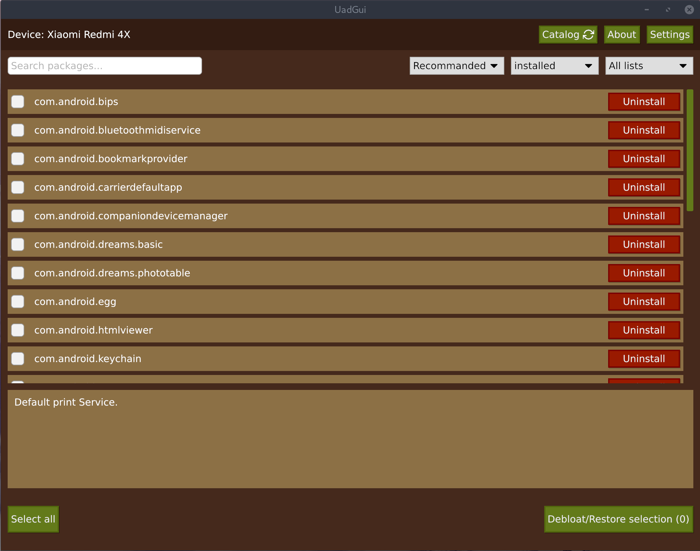

# Universal Android Debloater GUI
**DISCLAIMER**: Use it at your own risk. I am not responsible for anything that could happen to your phone. 



**This software is still in a very early stage of developpement. Check out the issues, and feel free to contribute!**

## Summary
This is a complete rewrite in Rust of the [UAD project](https://gitlab.com/W1nst0n/universal-android-debloater) which aims at improving privacy and battery performance by removing unnecessary and obscure system apps. This can also contribute to improve security by reducing [the attack surface](https://en.wikipedia.org/wiki/Attack_surface). 

Packages are as well documented as possible in order to provide a better understanding of what you can delete or not. The worse thing which could happen is removing an essential system package needed during boot causing then an unfortunate bootloop. After about 5 failed system boots, the phone will automatically reboot in recovery mode and you'll have to perform a FACTORY RESET. So make a backup!

In any case, you can NOT brick your device with this software! That's the main thing, right?

## Features 
* [X] Quick search among all the packages of an android device
* [X] Uninstallation/Reinstallation of system packages of system packages
* [X] Device brand detection and auto-selection of the appropriate manufacturer debloat list

NB : System apps cannot really be uninstalled without root (see the [FAQ](https://gitlab.com/W1nst0n/universal-android-debloater/-/wikis/FAQ))

## Universal debloat lists 
* [X] GFAM (Google/Facebook/Amazon/Microsoft)
* [X] AOSP
* [X] Manufacturers (OEM)
* [X] Mobile carriers
* [X] Qualcomm / Mediatek / Miscellaneous

## Manufacturers debloat lists
* [ ] Archos
* [X] Asus
* [ ] Blackberry
* [ ] Gionee
* [X] LG
* [X] Google
* [ ] HTC
* [X] Huawei
* [X] Motorola
* [X] Nokia
* [X] OnePlus
* [X] Oppo  
* [X] Samsung
* [X] Sony
* [ ] TCL
* [ ] Wiko
* [X] Xiaomi
* [ ] ZTE

## Mobile carriers debloat lists
|   Country       | Carriers                          |
|-----------------|-----------------------------------|
| France          | Orange, SFR, Free, Bouyges/Sosh   |
| USA             | T-Mobile, Verizon, Sprint, AT&T   |  
| Germany         | Telekom                           |


## How to use it 
- **Read the [FAQ](https://gitlab.com/W1nst0n/universal-android-debloater-rs/-/wikis/FAQ)!**
- **Do a proper backup of your data! You can never be too careful!**
- Enable *Developer Options* on your smartphone.
- Turn on *USB Debugging* from the developper panel.
- From the settings, disconnect from any OEM accounts (when you delete OEM account package it could lock you on the lockscreen because the phone can't associate your identity anymore)
- Install ADB:
<p>
<details>
<summary>LINUX</summary>

- Install *Android platform tools* on your PC :

Debian Base:
```bash
$ sudo apt install android-sdk-platform-tools
```
Arch-Linux Base:
```bash
$ sudo pacman -S android-tools
```
Red Hat Base:
```bash
$ sudo yum install android-tools
```
</details>
</p>

<p>
<details>
<summary>MAC OS</summary>

- Install [Homebrew](https://brew.sh/)
- Install *Android platform tools*

```bash
$ brew install android-platform-tools
```
</details>
</p>

<p>
<details>
<summary>WINDOWS</summary>

- Download [android platform tools](https://dl.google.com/android/repository/platform-tools-latest-windows.zip) and unzip it somewhere. [Add the folder to your PATH](https://www.architectryan.com/2018/03/17/add-to-the-path-on-windows-10/).

- [Install USB drivers of your device](https://developer.android.com/studio/run/oem-usb#Drivers)
- Check your device is detected:
```batch
> adb devices
```
</details>
</p>


- Download [the lastest release of Android Universal Debloater](https://gitlab.com/W1nst0n/uad-rust-gui/-/releases).

**NOTE:** Chinese phones users may need to use the AOSP list for removing some stock apps because those chinese manufacturers (especially Xiaomi and Huawei) have been using the name of AOSP packages for their own (modified & closed-source) apps.

**IMPORTANT NOTE:** You will have to run this software whenever your OEM push an update to your phone as some *uninstalled* system apps could be reinstalled.

## How to contribute

Hey-hey-hey! Don't go away so fast! This is a community project. That means I need you! I'm sure you want to make this project better anyway.

==> [How to contribute](https://gitlab.com/W1nst0n/universal-android-debloater-rs/-/wikis/home#how-to-contribute)

## Special thanks

[@mawilms](https://github.com/mawilms) for his LotRO plugin manager ([Lembas](https://github.com/mawilms/lembas)) which helped me a lot to understand how to use the [Iced](https://github.com/hecrj/iced) GUI library.